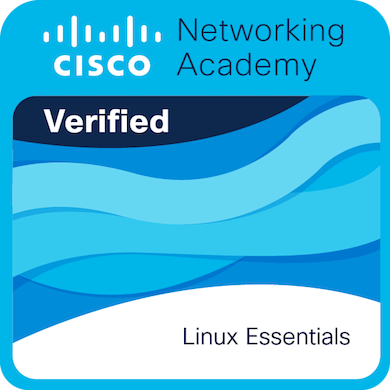
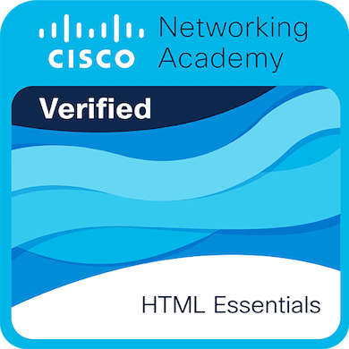

<!-- 
Keywords: IW Cyber Ops, Muhammad Imran Wakeel, Cisco Networking Academy Certificates, Linux Essentials Certified, Web Foundations HTML5, Cybersecurity Certified Professional, Verified Infosec Credentials, Offensive Security Certifications, Credly Digital Badges, Vulnerability Research Portfolio.
-->

# 🎖️ Official Certifications & Verified Credentials

> **Command Node:** `IW-Mission-Control/certifications`  
> **System Operator & Lead Researcher:** Muhammad Imran Wakeel (`@iwcyberops`)  
> **Mission Objective:** Cryptographically log, display, and verify all third-party industry credentials, academic validations, and digital badges earned across the 42-month cybersecurity master plan.

---

## 🏛️ Executive Credential Statement

In the high-assurance domain of vulnerability research and systems engineering, **certifications serve as independent, third-party proof of foundational mastery.**

Every credential documented in this ledger is aligned with a specific operational phase of the **42-Month Apex Hacker Roadmap**. From foundational Linux operating system governance and web client-server protocols to kernel exploitation and hardware security, this registry maintains an auditable, verifiable record of academic and practical achievements.

---

## 🏆 Visual Badge Showcase

<div align="center">

<table border="0">
  <tr>
    <!-- BADGE 01: CISCO LINUX ESSENTIALS -->
    <td align="center" width="220" valign="top">
      <a href="./01-cisco-linux-essentials/cisco-linux-essentials.pdf">
        
      </a>
      <br>
      <a href="https://www.credly.com/badges/a0f5cb68-36b5-47f2-9ad5-8ff4ace5af8d/public_url" target="_blank">Verify</a>
      <br>
      <b>Linux Essentials</b><br>
      <sub>Cisco Networking Academy</sub><br>
    </td>  <!-- 2nd badge - HTML Essentials -->
    <td align="center" width="220" valign="top">
      <a href="./02-cisco-html-essentials/cisco-html-essentials.pdf">
        
      </a>
      <br>
      <a href="https://www.credly.com/badges/69f53ac3-699a-4a3a-9412-f3202689e26d/public_url" target="_blank">Verify</a>
      <br>
      <b>HTML Web Foundations</b><br>
      <sub>Cisco Networking Academy</sub><br>
    </td>


  </tr>
</table>

</div>

---

## 📊 Live Verified Credentials Registry

| Credential Title | Issuing Body | Roadmap Phase Alignment | Issue Date | Verification Artifacts |
| :--- | :--- | :---: | :---: | :---: |
| **Linux Essentials** | **Cisco Networking Academy** | Phase 01 (Month 01) | 🟢 Active | [📄 PDF](./pdfs/cisco-linux-essentials.pdf) • [🎖️ Badge](./badges/cisco-linux-essentials.png) |
| **HTML / Web Development Essentials** | **Cisco Networking Academy** | Phase 01 (Month 05 & 07) | 🟢 Active | [📄 PDF](./pdfs/cisco-html-essentials.pdf) • [🎖️ Badge](./badges/cisco-html-essentials.png) |
<!-- ADD NEW REGISTRY ROWS ABOVE THIS LINE -->

---


## 🔒 Cryptographic File Integrity (SHA-256 Checksums)

To prove authenticity and verify that certificate documents have not been modified or tampered with, calculate and compare their SHA-256 hashes:

```text
# Cisco Linux Essentials
File: cisco-linux-essentials.pdf
SHA-256: []

# Cisco HTML Essentials
File: cisco-html-essentials.pdf
SHA-256: []
```

### Verification Command:
```bash
sha256sum pdfs/cisco-linux-essentials.pdf
```

---

## 🛡️ About the Researcher

**Muhammad Imran Wakeel** is an independent systems researcher, Hafiz al-Quran, and the Founder of **IW Cyber Ops**. This credentials registry forms a permanent record of validated competency supporting a 42-month journey engineered for absolute depth and high-impact vulnerability research.

To explore the overarching architectural roadmap, visit the official [IW-Mission-Control](https://github.com/iwcyberops/IW-Mission-Control) repository.

<br>

---
*Generated & Curated by **IW Cyber Ops** | High-Assurance Cyber Operations & Research*
